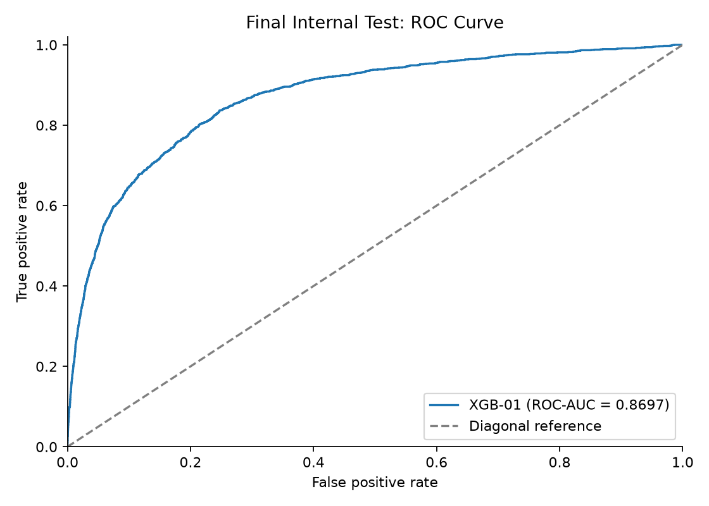
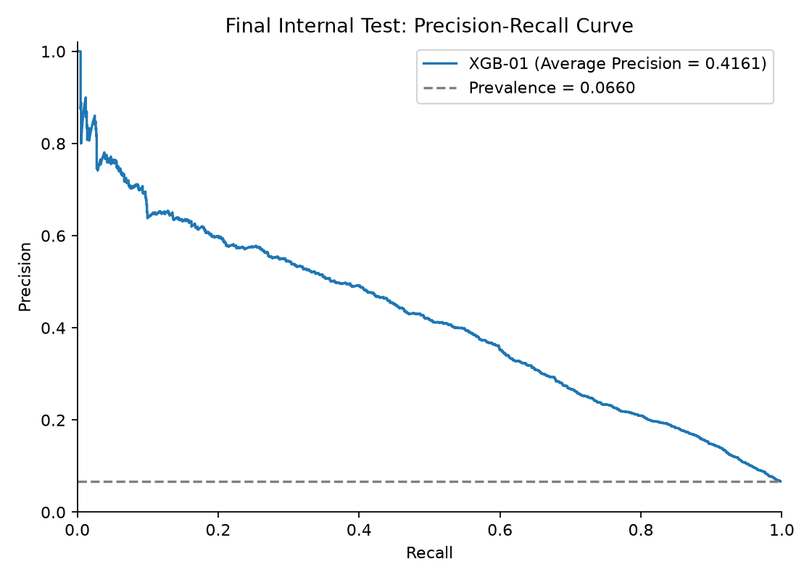
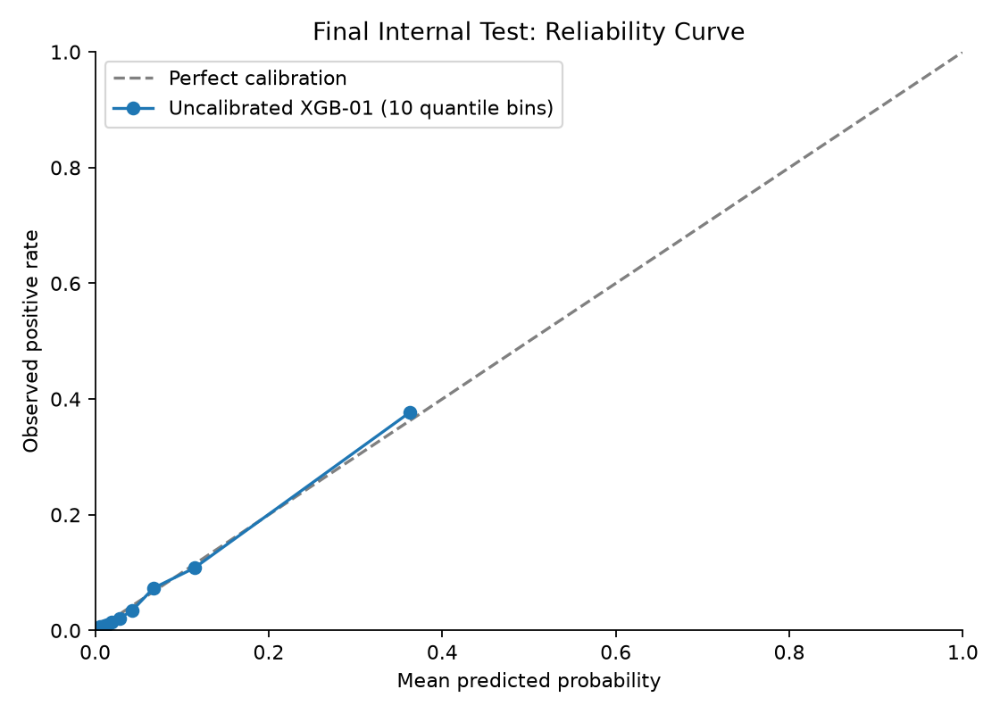
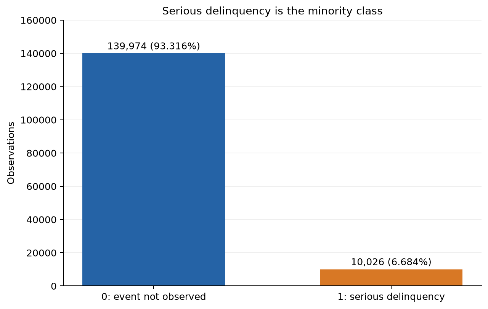
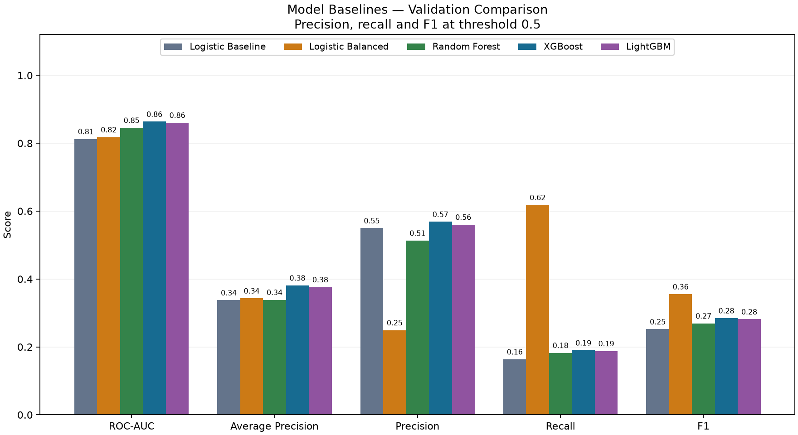
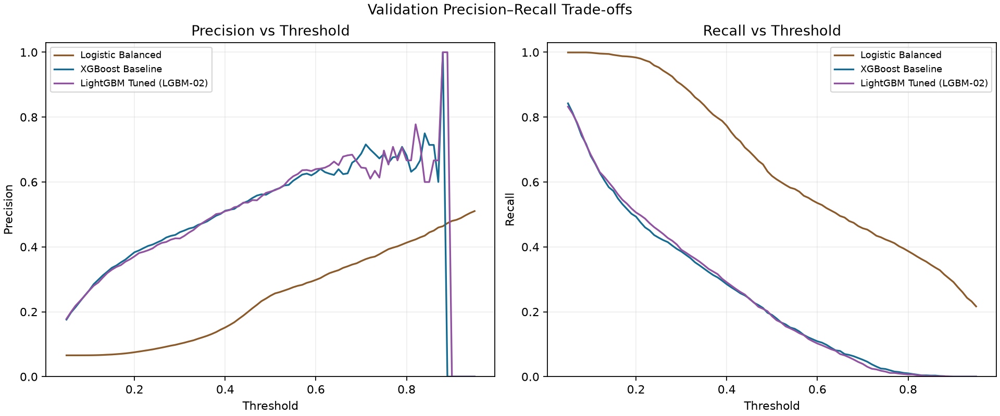
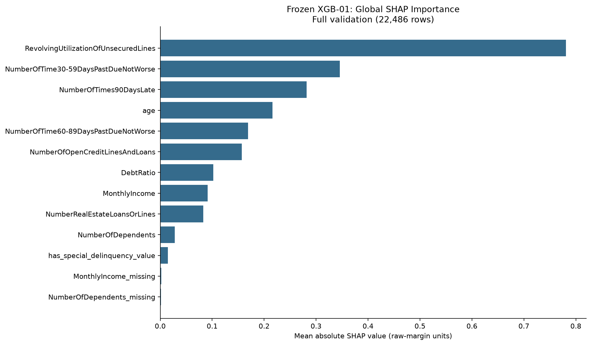
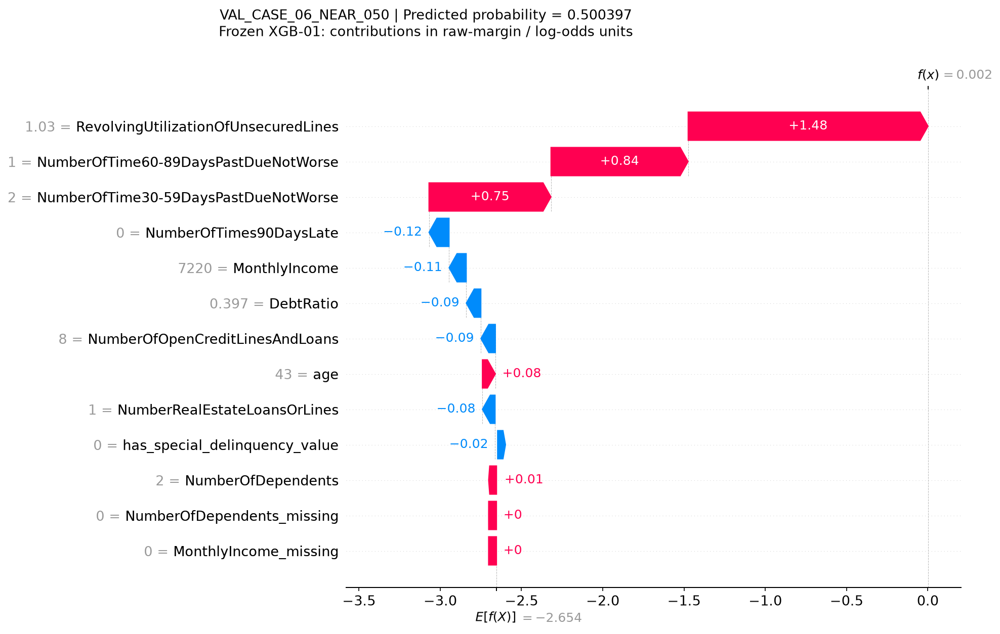

# Credit Risk Scoring & Explainable AI

A Python portfolio project for binary serious-delinquency prediction using the **Give Me Some Credit** dataset and target `SeriousDlqin2yrs`. The workflow addresses class imbalance through leakage-safe preprocessing, model comparison, targeted tuning, threshold analysis and probability calibration analysis. A frozen XGBoost pipeline is evaluated on an internal holdout, explained with global/local SHAP, and served through a FastAPI inference service.

## Project Highlights

- **150,000 labeled observations**, 10 raw predictors and an approximately 70/15/15 group-aware split.
- Identical raw feature vectors stay together to prevent duplicate-vector leakage across partitions and CV folds.
- Logistic Regression, Random Forest, XGBoost and LightGBM comparisons, including class-weight and SMOTE experiments.
- Training-only cross-validation for targeted tuning; validation-based threshold and calibration decisions frozen before final testing.
- Global and local SHAP explanations on validation data; a stateless API that loads the frozen pipeline.
- **410 passing automated tests at STEP 19**, covering the workflow and API contract.

## Final Model

| Item | Frozen choice |
| --- | --- |
| Model | XGBoost Baseline / XGB-01 |
| Trees / learning rate / maximum depth | `300` / `0.05` / `3` |
| Row / column sampling | `subsample=1.0`, `colsample_bytree=1.0` |
| Tree method / seed | `hist` / `random_state=42` |
| Preprocessing | Training-fitted tree pipeline; 10 raw inputs become 13 transformed features |
| Fitting data | Training partition only: 104,998 rows |
| Calibration | `none` (uncalibrated) |
| Development operating threshold | **0.19** |
| Default audit threshold | **0.50** |

Threshold **0.19** was selected on validation before opening the test set: among evaluated thresholds with **recall >= 50%**, maximize precision; break ties by higher F1, then higher threshold. Predictions use `score >= threshold`. This is a development operating point, not a bank-optimal threshold or lending policy.

The [selection rationale](reports/final_model_selection.md) and [frozen specification](reports/final_model_selection.json) record the complete configuration.

## Final Internal Test Results

The internal holdout contains **22,516 observations**, including **1,487 positives** (prevalence **6.604193%**). The frozen model was evaluated once in STEP 15. No model, preprocessing, calibration or threshold decision was changed using these results.

| Metric | Internal test |
| --- | ---: |
| ROC-AUC | 0.8697 |
| Average Precision (AP) | 0.4161 |
| Gini | 0.7393 |
| Brier score | 0.0477 |
| Log loss | 0.1734 |
| Expected Calibration Error (ECE) | 0.0054 |

AP summarizes the precision-recall curve. ECE uses 10 requested quantile bins, removing duplicate edges and omitting empty bins. Values here are rounded; [test results JSON](reports/final_test_results.json) retains full precision and the [evaluation report](reports/final_test_evaluation.md) documents the audit.

### Frozen Threshold Results

| Threshold | Precision | Recall | F1 | Predicted positive rate |
| --- | ---: | ---: | ---: | ---: |
| 0.50 — default audit | 0.6026 | 0.1876 | 0.2862 | 0.0206 |
| 0.19 — development operating | 0.4034 | 0.5319 | 0.4588 | 0.0871 |

Rates are fractions, not percentages. **Neither threshold was tuned on test. The internal test set is consumed and must not guide further development.**







## Dataset

[Give Me Some Credit on Kaggle](https://www.kaggle.com/competitions/GiveMeSomeCredit/data) supplies the labeled source, `data/raw/cs-training.csv`. The target `SeriousDlqin2yrs` indicates whether a person experienced **90 days past due delinquency or worse within two years**: `1` indicates the event; `0` indicates no such event in that window. It does not mean bankruptcy.

The source has **10,026 positives (6.684%)**. Predictors describe revolving utilization, age, delinquency counts, debt ratio, income, open credit lines/loans, real-estate loans/lines and dependents. The extra `Unnamed: 0` column is a source index outside the Data Dictionary, not a predictor or confirmed borrower identifier.

Only `cs-training.csv` supplies the project partitions. Local `train.csv`/`test.csv` files are not used as the principal split, and Kaggle's unlabeled `cs-test.csv` is not used for model evaluation. Raw data stays local and Git-ignored; processed CSVs are not exported.



## Leakage Prevention & Holdout Discipline

The raw labeled data is split **before learned preprocessing**. Deterministic groups use all 10 raw predictive features, including matching missing-value patterns, without the target or source index. Feature-identical observations remain in the same partition; grouping does not establish borrower identity.

Two `GroupShuffleSplit` stages with `random_state=42` produce an approximately 70/15/15 split. This is **group-aware, not a stratified holdout algorithm**; class balance and partition invariants are checked separately.

| Partition | Observations | Positives |
| --- | ---: | ---: |
| Training | 104,998 | 7,061 |
| Validation | 22,486 | 1,478 |
| Internal test | 22,516 | 1,487 |

- Source-row/index overlap and feature-group overlap are zero across partitions.
- Development CV uses five-fold `StratifiedGroupKFold` within training, with shared folds for comparisons.
- Imputation/scaling statistics are learned only from training or the current fitting fold. SMOTE is confined to fitting data; validation and test are never resampled.
- Model, preprocessing, calibration and thresholds were frozen before final internal test evaluation. The final pipeline was not refitted on combined training and validation data.
- SHAP uses validation observations. API tests use invented requests. Neither uses internal test observations for development.

See [split implementation](src/data_split.py). The earlier full-dataset EDA visibility is disclosed under Limitations.

## Data Quality Handling

| Condition | Implemented handling |
| --- | --- |
| `Unnamed: 0` | Excluded from model inputs and feature groups |
| `age == 0` | Treated as missing inside preprocessing, then training-fitted median imputation |
| Missing `MonthlyIncome` | Missingness indicator plus training-fitted median |
| Missing `NumberOfDependents` | Missingness indicator plus training-fitted median |
| `MonthlyIncome == 0` | Preserved as an observed zero |
| Delinquency values `96` / `98` | Combined special-value indicator created first; these values then become missing before training-fitted imputation |
| Extreme ratios | Retained; no arbitrary capping |

The meaning of `96`/`98` is undocumented; they are not asserted to be confirmed errors. The tree pipeline produces 13 features without scaling; linear pipelines scale the 10 numeric features while retaining three binary indicators. Raw data is never modified. See [data quality decisions](reports/data_quality_decisions.md) and the implemented [preprocessing pipeline](src/preprocessing.py).

## Modeling Experiments

All metrics below are **validation** results, separate from the final internal test.

| Model | ROC-AUC | AP | Role |
| --- | ---: | ---: | --- |
| Logistic Baseline | 0.8128 | 0.3378 | Linear baseline |
| Logistic Balanced | 0.8180 | 0.3434 | Imbalance-adjusted linear reference |
| Random Forest | 0.8457 | 0.3389 | Tree benchmark |
| XGBoost Baseline / XGB-01 | 0.8637 | 0.3813 | Frozen final development model |
| XGBoost Tuned / XGB-07 | 0.8635 | 0.3820 | Best XGBoost configuration by training CV |
| LightGBM Tuned / LGBM-02 | 0.8641 | 0.3817 | Best LightGBM configuration by training CV |

Targeted tuning compared 16 configurations through training CV. XGB-07 delivered only a small CV AP gain and slightly lower validation ROC-AUC than XGB-01. XGB-01 had higher training CV AP than LGBM-02, despite LGBM-02's marginally higher validation metrics. The final decision considered **training CV, simplicity, calibration and threshold behavior**, rather than selecting the largest validation metric alone.

Sources: [baseline comparison](reports/model_baseline_comparison.csv), [tuned comparison](reports/tuned_boosting_comparison.csv) and [tuning audit](reports/boosting_tuning_results.json).

The following figure compares the original baselines; its LightGBM entry is the untuned baseline.



### Class Imbalance

At threshold 0.50 on validation, Logistic Baseline recall was **0.1637**. Class weighting increased recall to **0.6184** with precision **0.2495**; SMOTE achieved recall **0.6346** with precision **0.2372**. Both increased false positives. SMOTE remains a documented benchmark but was not selected for the final strategy. See [imbalance experiments](reports/logistic_imbalance_experiments.json).

## Threshold Analysis

The validation study evaluated 91 thresholds per candidate, from 0.05 to 0.95 in 0.01 increments. For XGBoost Baseline:

| Validation threshold | Precision | Recall | F1 |
| --- | ---: | ---: | ---: |
| 0.50 | 0.5688 | 0.1901 | 0.2850 |
| 0.19 | 0.3723 | 0.5020 | 0.4275 |

Threshold 0.50 is conservative relative to the development goal of at least 50% recall. Threshold 0.19 met that goal under the frozen selection rule. No business cost matrix was supplied, so no financial optimum is claimed. See [threshold scenarios](reports/threshold_scenarios.csv).



## Probability Calibration

Training-only group-aware calibration compared uncalibrated, sigmoid and isotonic versions of three candidates. Logistic Balanced was strongly miscalibrated without adjustment; both calibration methods substantially improved its probability metrics.

XGBoost Baseline was already relatively well calibrated on validation: **Brier 0.0491, log loss 0.1777, ECE 0.0054**. Sigmoid worsened these metrics. Isotonic offered only very small Brier/log-loss gains, so the final model retained **no calibration layer** for simplicity. These are internally audited risk scores, not regulatory or production-validated probabilities of default. See [calibration results](reports/calibration_results.json).

## Explainability with SHAP

Global SHAP explanations use the **22,486 validation observations** and all **13 transformed features**. The top five features by mean absolute SHAP value are:

1. `RevolvingUtilizationOfUnsecuredLines`
2. `NumberOfTime30-59DaysPastDueNotWorse`
3. `NumberOfTimes90DaysLate`
4. `age`
5. `NumberOfTime60-89DaysPastDueNotWorse`

SHAP values are in **XGBoost raw-margin/log-odds space**, not additive probability percentages. Additivity checks passed. Local explanations cover six validation cases selected by score position, including observations near the two frozen thresholds; selection did not use target labels.

SHAP explains model behavior, not causality, and is not a regulatory adverse-action explanation. Details: [global report](reports/shap_global_explainability.md), [feature importance](reports/shap_global_importance.csv) and [local report](reports/shap_local_explainability.md).





## FastAPI Inference Service

The service loads the frozen `models/final_model.joblib` pipeline once per application lifespan, verifies SHA-256 before deserialization, and performs inference only. Requests are stateless; applicant payloads are not logged by default.

| Endpoint | Purpose |
| --- | --- |
| `GET /health` | Readiness: `{"status":"ok","model_loaded":true}` after successful startup |
| `GET /model-info` | Frozen model, calibration, thresholds, feature schema and artifact identity |
| `POST /predict` | Serious-delinquency score and flags for the two frozen thresholds |

All **10 raw feature keys are required**; extra fields are forbidden. `MonthlyIncome` and `NumberOfDependents` accept `null`. Missing income differs from observed income `0`. `age=0` and delinquency values `96`/`98` are accepted for handling by the frozen pipeline. Numeric inputs are validated; invalid requests return sanitized errors. Threshold flags use inclusive `>=` comparisons and are not loan approval/decline decisions.

### Example Request and Response

This invented request is the existing STEP 19 API example, not a real test observation. Send it to `POST /predict`, for example through the local Swagger UI:

```json
{
  "RevolvingUtilizationOfUnsecuredLines": 0.35,
  "age": 45,
  "NumberOfTime30-59DaysPastDueNotWorse": 0,
  "DebtRatio": 0.3,
  "MonthlyIncome": 5000,
  "NumberOfOpenCreditLinesAndLoans": 6,
  "NumberOfTimes90DaysLate": 0,
  "NumberRealEstateLoansOrLines": 1,
  "NumberOfTime60-89DaysPastDueNotWorse": 0,
  "NumberOfDependents": 2
}
```

Recorded response from the verified artifact:

```json
{
  "model_name": "XGBoost Baseline / XGB-01",
  "predicted_probability": 0.02612978406250477,
  "calibration": "none",
  "development_operating_threshold": 0.19,
  "above_development_operating_threshold": false,
  "default_audit_threshold": 0.5,
  "above_default_audit_threshold": false,
  "disclaimer": "This is an internal portfolio risk-scoring model and is not a production lending decision system."
}
```

API predictions matched direct artifact predictions exactly on the recorded toy parity checks. See [API implementation and checks](reports/api_implementation.md).

## Project Structure

```text
credit-risk-scoring-xai/
├── api/                     # App, input/output schemas and artifact-loading service
├── data/
│   ├── raw/                 # Local source data; Git-ignored except .gitkeep
│   └── processed/           # Currently only .gitkeep; no exported processed data
├── models/                  # Local ignored final_model.joblib and tracked .gitkeep
├── notebooks/
│   └── 01_eda.ipynb
├── reports/                 # Decisions, metrics, freeze and serialization metadata
│   └── figures/
├── src/                     # Split, preprocessing, experiments, evaluation and SHAP
├── tests/                   # Automated workflow and API checks
├── .gitignore
├── requirements.txt
└── README.md
```

## Reproducing the Project

The recorded environment is **Windows, Python 3.13.14**. Use the pinned dependencies and run commands from the repository root. These instructions bootstrap a fresh checkout; an existing verified artifact does not need regeneration for ordinary API use.

1. Clone and create a local virtual environment using the compatible installed Python:

   ```powershell
   git clone https://github.com/vunghia54/credit-risk-scoring-xai.git
   cd credit-risk-scoring-xai
   python -m venv .venv
   .\.venv\Scripts\python.exe -m pip install -r requirements.txt
   .\.venv\Scripts\python.exe -m pip check
   ```

2. Obtain the labeled Kaggle `cs-training.csv` and place it at `data/raw/cs-training.csv`. The dataset is intentionally absent from Git. Source-file identity and software versions are recorded in the audit artifacts.

3. Run the pre-API checks before a local artifact exists:

   ```powershell
   .\.venv\Scripts\python.exe -m pytest -v --ignore=tests/test_api.py
   ```

4. Generate the local artifact using the existing frozen serialization workflow, then run the complete suite:

   ```powershell
   .\.venv\Scripts\python.exe -m src.serialize_model
   .\.venv\Scripts\python.exe -m pytest -v
   ```

   Serialization fits the frozen configuration on training only, verifies load-back predictions on validation, and writes the ignored binary plus serialization audit reports. It does not rerun final internal test evaluation. Full API tests require the local artifact and verify the approved hash; they cannot pass on a fresh clone before this step. Binary identity is not guaranteed across arbitrary environments; investigate a mismatch rather than bypassing integrity checks.

5. Start the API locally:

   ```powershell
   .\.venv\Scripts\python.exe -m uvicorn api.main:app --host 127.0.0.1 --port 8000
   ```

   Open [Swagger UI](http://127.0.0.1:8000/docs) or [ReDoc](http://127.0.0.1:8000/redoc). No terminal activation is needed when using the explicit `.venv` interpreter. In Visual Studio 2022, use this same project environment.

The published test evaluation is a consumed holdout result, not a development command to rerun. See [serialization instructions and audit](reports/model_serialization.md).

## Tech Stack

Python, pandas, NumPy, scikit-learn, imbalanced-learn, XGBoost, LightGBM, SHAP, Matplotlib, joblib, FastAPI, Pydantic, Uvicorn, HTTPX and pytest. Notebook and Excel-dictionary support use ipykernel and xlrd. Direct dependency versions are pinned in [requirements.txt](requirements.txt).

## Testing

The STEP 19 verification recorded **410 passing tests**, including 70 API tests. Tests cover splitting, leakage invariants, preprocessing, modeling, tuning, thresholding, calibration, SHAP, serialization and API contracts. API tests use FastAPI TestClient and toy inputs, without starting a long-running server. Existing SHAP and Starlette/HTTPX deprecation warnings did not affect correctness. No coverage percentage is claimed.

This README-only update does not add tests or rerun model workflows.

## Reproducibility

Deterministic feature groups, `random_state=42`, group-aware CV, pinned direct dependencies and frozen configuration artifacts document the development process. Model metadata records software versions, SHA-256 and validation load-back parity. The binary is intentionally Git-ignored and generated locally; project source must remain importable for custom preprocessing classes.

Approved artifact SHA-256, recorded in [artifact metadata](reports/final_model_artifact_metadata.json):

```text
e99eb083596beac8b6b53c8ac75d90b028dce7bf9229d759a2967709d9084590
```

The final internal test was consumed once; subsequent SHAP, serialization and API work did not use it for development decisions.

## Limitations

- This is a Kaggle dataset, not a bank's current production portfolio. Evaluation uses an internal holdout, not external or temporal validation.
- **EDA preceded the final internal split lock**, so the analyst had prior visibility into the full labeled dataset. The holdout is not equivalent to a prospectively untouched external sample; repeated validation use can also introduce selection optimism.
- Delinquency values `96`/`98` have undocumented meaning. Their handling is an explicit modeling decision.
- SHAP describes model associations, not causality or a regulatory adverse-action explanation. Scores are not regulatory/production PD estimates, and threshold 0.19 is not a lending policy.
- No protected-group fairness analysis was performed. Attributes such as sex and race are absent; **age is present**, but no subgroup-fairness claim is made.
- The API has no authentication or rate limiting and is intended for local portfolio demonstration.
- joblib artifacts require trusted sources and compatible library versions. Deserialization can execute code; SHA-256 detects changes against a trusted reference but does not establish trust by itself.

## Responsible Use

This is educational portfolio work. The model should not autonomously approve or decline credit. Any operational use requires domain, business and governance review; fairness cannot be inferred from absent attributes or unmeasured subgroup outcomes.

## Key Takeaways

- Boosting improved ranking over the Logistic baseline on the recorded development comparisons.
- Threshold choice materially changed precision and recall; one accuracy figure would obscure minority-class performance.
- Class weighting improved recall while changing score calibration, making ranking and probability quality separate evaluation concerns.
- Freezing decisions before final evaluation prevented post-test tuning, while explicit EDA limitations keep the holdout claims appropriately scoped.
